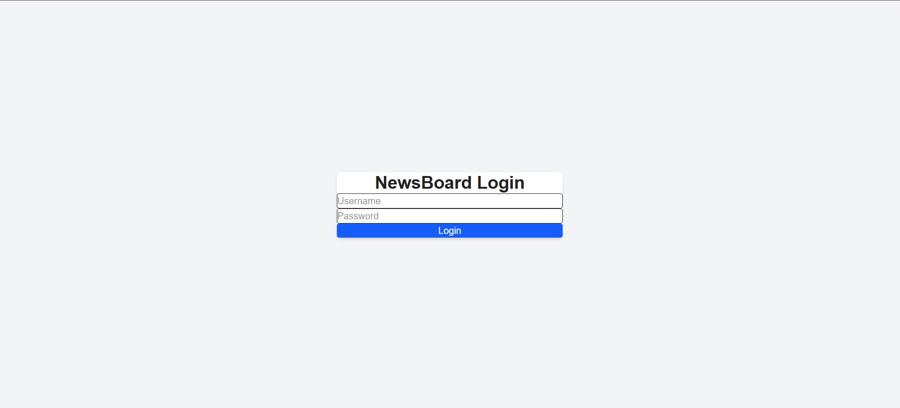
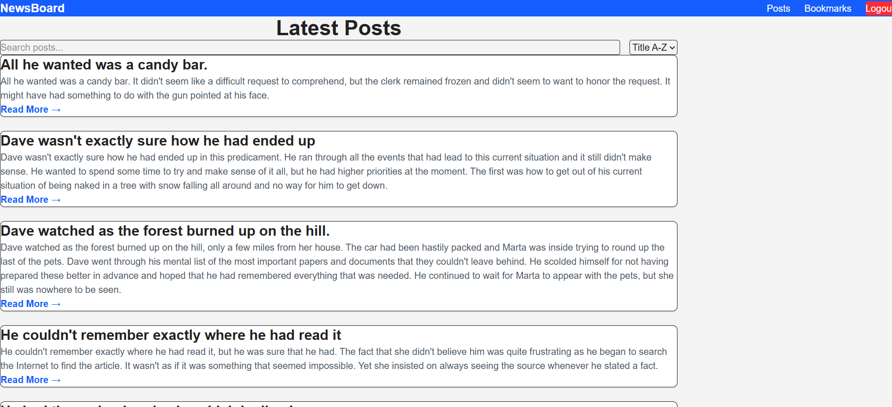
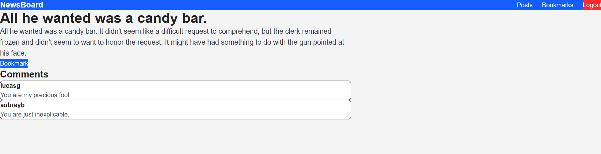
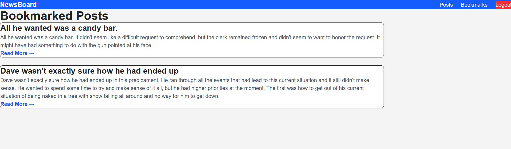

# 📰 NewsBoard - Mini Blog Dashboard

A modern React-based blog dashboard that allows users to authenticate, browse posts, search, sort, paginate, view post details, read comments, and bookmark their favorite posts.

Built using **React**, **Vite**, **React Router**, **Axios**, **Tailwind CSS**, and **Context API**.

---

## 🚀 Features

### 🔐 Authentication
- User Login
- JWT-based Authentication
- Protected Routes
- Logout Functionality
- Persistent Login using Local Storage

### 📰 Posts Dashboard
- Fetch posts from DummyJSON API
- Responsive Post Cards
- Search Posts
- Debounced Search
- Sort Posts (A-Z / Z-A)
- Pagination

### 📄 Post Details
- View Complete Post
- View Comments
- Error Handling for Invalid Posts

### ⭐ Bookmarks
- Add Bookmark
- Remove Bookmark
- Persistent Bookmarks using Local Storage
- Dedicated Bookmarks Page

### 🎨 User Interface
- Responsive Design
- Loading Indicators
- Error Handling
- Clean Navigation
- Tailwind CSS Styling

---

# 🛠️ Technologies Used

- React 19
- Vite
- React Router DOM
- Axios
- Tailwind CSS
- Context API
- Local Storage
- JavaScript (ES6+)

---

# 📁 Project Structure

```
src/
│
├── assets/
│
├── components/
│   ├── Navbar/
│   └── PostCard/
│
├── context/
│   ├── AuthContext.jsx
│   └── BookmarkContext.jsx
│
├── hooks/
│   └── useDebounce.js
│
├── pages/
│   ├── Login/
│   ├── Posts/
│   ├── PostDetails/
│   └── Bookmarks/
│
├── routes/
│   ├── AppRoutes.jsx
│   └── ProtectedRoute.jsx
│
├── services/
│   ├── api.js
│   ├── authService.js
│   └── postService.js
│
├── App.jsx
├── main.jsx
└── index.css
```

---

# 🌐 API Used

DummyJSON API

Authentication

```
POST https://dummyjson.com/auth/login
```

Posts

```
GET https://dummyjson.com/posts
```

Single Post

```
GET https://dummyjson.com/posts/:id
```

Comments

```
GET https://dummyjson.com/posts/:id/comments
```

Official Documentation

https://dummyjson.com/

---

# ⚙️ Installation

Clone the repository

```bash
git clone https://github.com/nickjv12/newsboard-blog-react.git
```

Move into the project directory

```bash
cd newsboard
```

Install dependencies

```bash
npm install
```

Start the development server

```bash
npm run dev
```

Open your browser

```
http://localhost:5173
```

---

# 🔑 Demo Credentials

Use DummyJSON Login

```
Username:
emilys

Password:
emilyspass
```

---

# 📸 Screenshots

## Login Page



---

## Posts Dashboard



---

## Post Details



---

## Bookmarks



---

# ✨ Future Improvements

- Dark Mode
- User Profile
- Category Filtering
- Infinite Scrolling
- Redux Toolkit
- Unit Testing
- API Caching
- Skeleton Loading

---

# 📚 Learning Outcomes

This project demonstrates knowledge of

- React Components
- React Hooks
- React Router
- Context API
- Axios
- Authentication
- Protected Routes
- API Integration
- State Management
- Local Storage
- Pagination
- Debouncing
- Responsive UI Design

---

# 🧪 Available Scripts

Run development server

```bash
npm run dev
```

Build production version

```bash
npm run build
```

Preview production build

```bash
npm run preview
```

Lint project

```bash
npm run lint
```

---

# 👨‍💻 Author

**Shambhavi Mishra**
Registration Number:20221088
Electronics and Communication Engineering Student

---

# 📄 License

This project is created for educational and learning purposes.